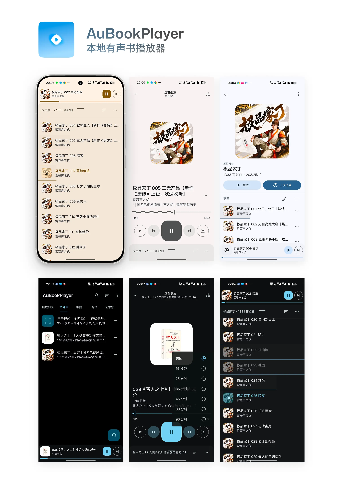

# AuBookPlayer | 本地有声书播放器

- [https://qzrzz.github.io/AuBookPlayer/](https://qzrzz.github.io/AuBookPlayer/)
- [下载](https://github.com/qzrzz/AuBookPlayer/releases)

一个简单的 Android 本地有声书播放器。

基于开源音乐播放器 [Auxio](https://github.com/oxygencobalt/Auxio) 改造而来，以适用于播放本地有声书（音频文件）的场景。

很难想象，Android 上竟然没有一款播放本地有声书时好用的播放器，要么缺少功能（跳过头尾、倍数播放、定时关闭）
要么复杂难用，要么广告太多。所以我基于基于开源音乐播放器 [Auxio](https://github.com/oxygencobalt/Auxio) 开发出 AuBookPlayer，专为简单
好用的播放本地有声书。

- 倍数播放
- 定时关闭
- 跳过头尾
  - 智能识别音频片头片尾（根据多个音频头尾相同内容识别）
- 以播放列表为核心
- 自动生成封面，没有封面时提取标题关键词生成封面图
- 手动设置封面图片
- 优化展示超长节目名称（多行显示）
- 播放列表播放「上次进度」功能
- 已播放节目记录，在列表中显示已播放
- 每个音频都记录播放进度记录（可以在列表更多菜单的「重置播放记录」中重置）

> 注意这里的有声书是指音频文件有声书，而不是文本转语音。
> 